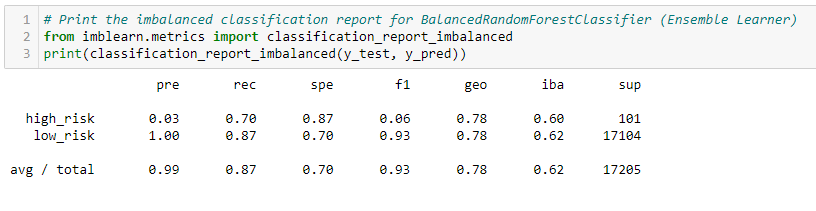

# Credit Risk Analysis

## Overview of the Credit Risk Analysis

### Purpose

In Module Seventeen, Supervised Machine Learning is introduced for use in data analytics.  Logistic Regression, Decision Tree, Random Forest, and Support Vector machine algorithms, in addition to ensemble and resampling techniques, were implemented in this module to analyze credit card risk.

### Results

### Resampling

- **Naive Random Oversampling:**
  - Balanced Accuracy Score 69% 
  - F1 Score 75%

- **SMOTE Oversampling:**
  - Balanced Accuracy Score 66% 
  - F1 Score 81%

- **ClusterCentroids Resampler:**
  - Balanced Accuracy Score 64%
  - F1 Score 72%

- **SMOTEENN:**
  - Balanced Accuracy Score 64% 
  - F1 Score 72%

### Ensemble

- **Balanced Random Forest Classifier:**
  - Balanced Accuracy Score 79% 
  - F1 Score 93%

- **Easy Ensemble AdaBoost Classifier:**
  - Balanced Accuracy Score 93% 
  - F1 Score 97%

## Summary

The resampling machine learning models produced moderate results ranging in F1 Scores of 70% - 80%.  The ensemble machine learning models, BalancedRandomForestClassifier and Easy Ensemble AdaBoost Classifier, produced superior results at rates of 90% or above in comparison to the resampling methods. The ensemble machine learning method, BalancedRandomForestClassifier, also produced important features for the credit risk analysis.  Therefore my recommendation for the credit risk analysis would be to implement the ensemble machine learning models, specifically AdaBoost Classifier, because of its compounded machine learning algorithms and higher F1 scores.